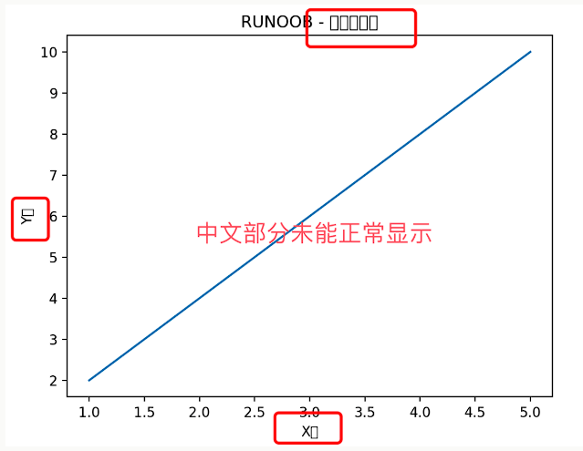
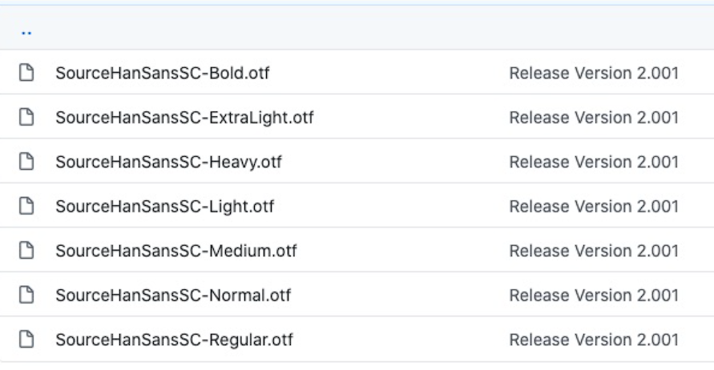

# Matplotlib 中文显示
Matplotlib 中文显示不是特别友好，要在 Matplotlib 中显示中文，我们可以通过两个方法：

设置 Matplotlib 的字体参数。
下载使用支持中文的字体库。
在未设置字体，默认情况显示如下，中文部分不能正常显示：


## Matplotlib 的字体参数
我们可以先获取系统的字体库列表：
```python
from matplotlib import pyplot as plt
import matplotlib
a=sorted([f.name for f in matplotlib.font_manager.fontManager.ttflist])

for i in a:
    print(i)
```

输出结果类似如下：
```plain
...
Heiti TC
Helvetica
Helvetica Neue
Herculanum
Hiragino Maru Gothic Pro
Hiragino Mincho ProN
Hiragino Sans
Hiragino Sans GB
Hoefler Text
...
```
以上代码输出 font_manager 的 ttflist 中所有注册的名字，找一个看中文字体例如：STFangsong(仿宋）、Heiti TC（黑体）,然后添加以下代码即可。

对于 Windows：
```python
plt.rcParams['font.family'] = 'SimHei'  # 替换为你选择的字体
在 Windows 系统上，选择 SimHei（黑体）或其他中文字体，并将其设置为 Matplotlib 的默认字体。
```
对于 Linux：
```python
plt.rcParams['font.family'] = 'WenQuanYi Micro Hei'  # 替换为你选择的字体
在Linux系统上，使用 fc-list 命令查看已安装的字体，选择一个中文字体，并将其设置为 Matplotlib 的默认字体。
```
对于 macOS：
```python
plt.rcParams['font.family'] = 'Heiti TC'  # 替换为你选择的字体
```
通过设置 plt.rcParams['font.family']，你告诉 Matplotlib 使用选择的字体来渲染文本，从而在图表中正确显示中文。

这样，你就能够在 Matplotlib 图表中使用系统支持的中文字体了。

## 各大平台系统通用方法
```python
# -------------------------- 设置中文字体 start --------------------------
plt.rcParams['font.sans-serif'] = [
    # Windows 优先
    'SimHei', 'Microsoft YaHei',
    # macOS 优先
    'PingFang SC', 'Heiti TC',
    # Linux 优先
    'WenQuanYi Micro Hei', 'DejaVu Sans'
]
# 修复负号显示为方块的问题
plt.rcParams['axes.unicode_minus'] = False
# -------------------------- 设置中文字体 end --------------------------
```

## 使用字体库
Matplotlib 默认情况不支持中文，我们可以使用以下简单的方法来解决。

这里我们使用思源黑体，思源黑体是 Adobe 与 Google 推出的一款开源字体。

官网：https://source.typekit.com/source-han-serif/cn/

GitHub 地址：https://github.com/adobe-fonts/source-han-sans/tree/release/OTF/SimplifiedChinese

打开链接后，在里面选一个就好了：


你也可以在网盘下载: https://pan.baidu.com/s/10-w1JbXZSnx3Tm6uGpPGOw，提取码：yxqu。

可以下载个 OTF 字体，比如 SourceHanSansSC-Bold.otf，将该文件文件放在当前执行的代码文件中：