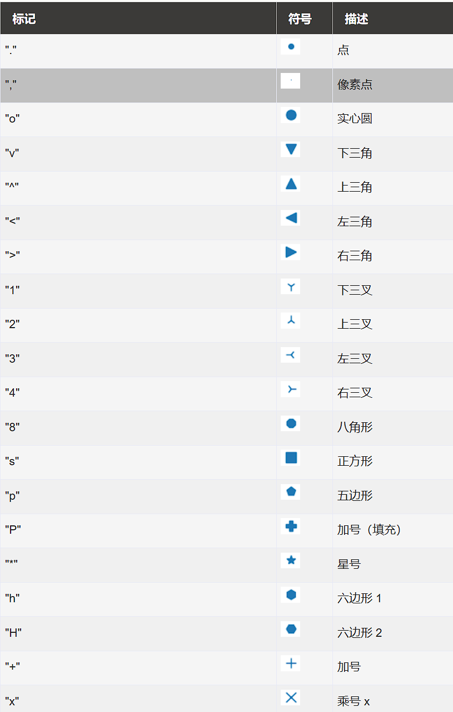
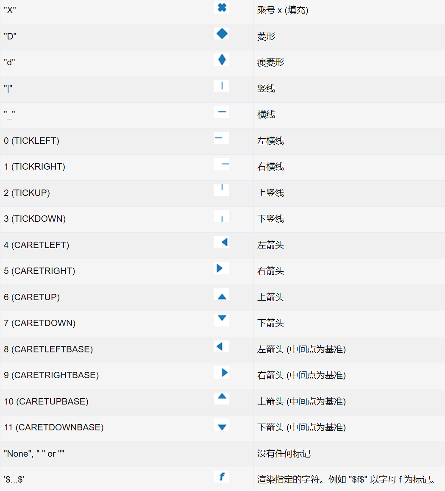

# Matplotlib 绘图标记
绘图过程如果我们想要给坐标自定义一些不一样的标记，就可以使用 plot() 方法的 marker 参数来定义。

## 标记表
marker 可以定义的符号如下：

## 线类型
线类型标记	|描述
---|---
'-'	|实线
':'	|虚线
'--'	|破折线
'-.'	|点划线

## 颜色类型
颜色标记	|描述
---|---
'r'	|红色
'g'	|绿色
'b'	|蓝色
'c'	|青色
'm'	|品红
'y'	|黄色
'k'	|黑色
'w'	|白色

## fmt 参数
fmt 参数定义了基本格式，如标记、线条样式和颜色。

fmt = '[marker][line][color]'
例如 o:r，o 表示实心圆标记，: 表示虚线，r 表示颜色为红色。

## 标记大小与颜色
我们可以自定义标记的大小与颜色，使用的参数分别是：
- markersize，简写为 ms：定义标记的大小。
- markerfacecolor，简写为 mfc：定义标记内部的颜色。
- markeredgecolor，简写为 mec：定义标记边框的颜色。
