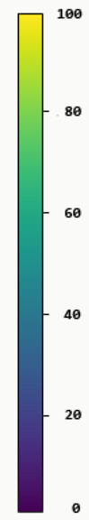
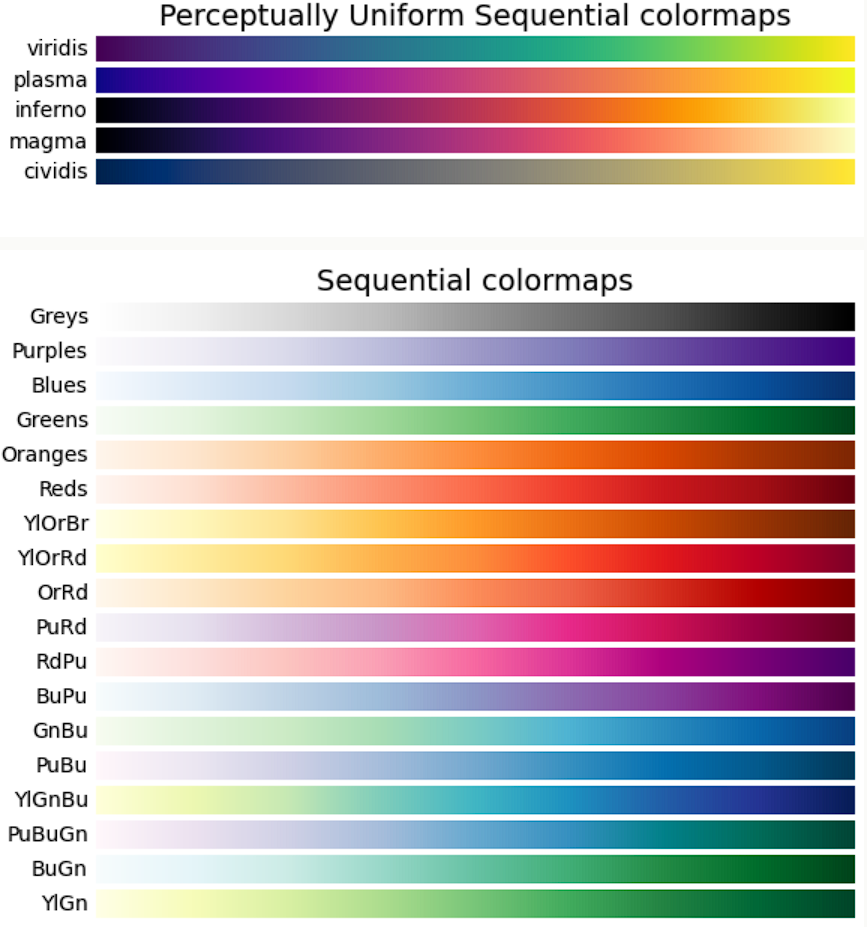
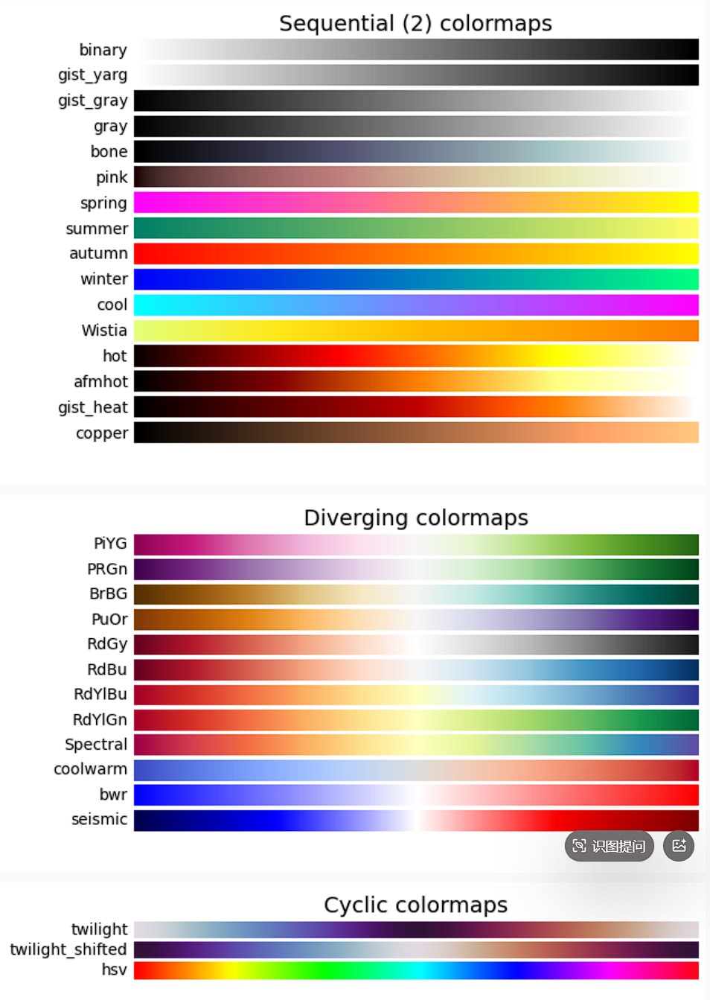
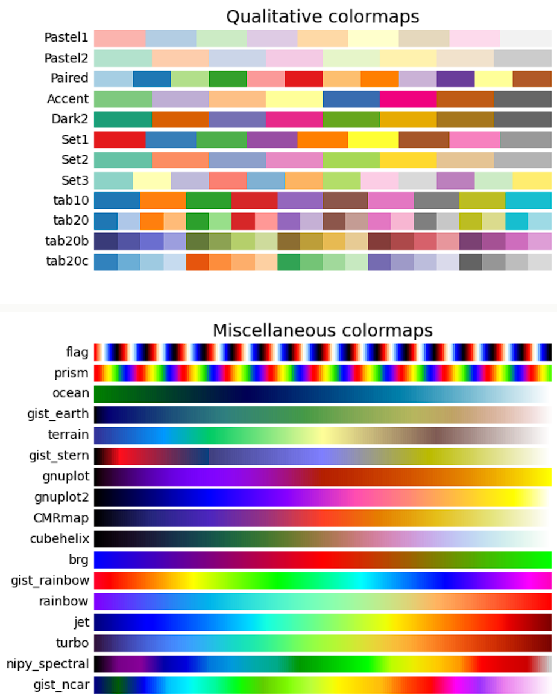

# Matplotlib 散点图
我们可以使用 pyplot 中的 scatter() 方法来绘制散点图。

## scatter()
scatter() 方法语法格式如下：
```python
matplotlib.pyplot.scatter(x, y, s=None, c=None, marker=None, cmap=None, norm=None, vmin=None, vmax=None, alpha=None, linewidths=None, *, edgecolors=None, plotnonfinite=False, data=None, **kwargs)
```
参数说明：
- x，y：长度相同的数组，也就是我们即将绘制散点图的数据点，输入数据。

- s：点的大小，默认 20，也可以是个数组，数组每个参数为对应点的大小。

- c：点的颜色，默认蓝色 'b'，也可以是个 RGB 或 RGBA 二维行数组。

- marker：点的样式，默认小圆圈 'o'。

- cmap：Colormap，默认 None，标量或者是一个 colormap 的名字，只有 c 是一个浮点数数组的时才使用。如果没有申明就是 image.cmap。

- norm：Normalize，默认 None，数据亮度在 0-1 之间，只有 c 是一个浮点数的数组的时才使用。

- vmin，vmax：：亮度设置，在 norm 参数存在时会忽略。

- alpha：：透明度设置，0-1 之间，默认 None，即不透明。

- linewidths：：标记点的长度。

- edgecolors：：颜色或颜色序列，默认为 'face'，可选值有 'face', 'none', None。

- plotnonfinite：：布尔值，设置是否使用非限定的 c ( inf, -inf 或 nan) 绘制点。

- **kwargs：：其他参数。

# 颜色条 Colormap
Matplotlib 模块提供了很多可用的颜色条。

颜色条就像一个颜色列表，其中每种颜色都有一个范围从 0 到 100 的值。

下面是一个颜色条的例子：

设置颜色条需要使用 cmap 参数，默认值为 'viridis'，之后颜色值设置为 0 到 100 的数组。

颜色条参数值可以是以下值：


