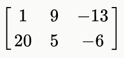
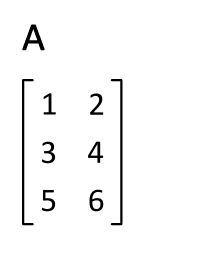
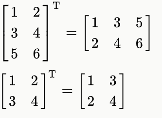
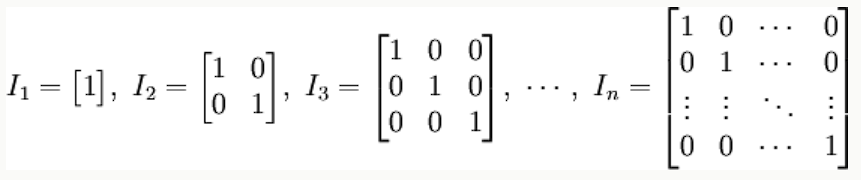

# NumPy 矩阵库(Matrix)
NumPy 中包含了一个矩阵库 numpy.matlib，该模块中的函数返回的是一个矩阵，而不是 ndarray 对象。

numpy.matlib 专门用于创建和操作 矩阵（matrix） 对象。虽然 NumPy 的核心支持多维数组（ndarray），numpy.matlib 提供了一些方便的函数，专门返回矩阵类型，便于用户进行传统的线性代数运算。

一个 的矩阵是一个由行（row）列（column）元素排列成的矩形阵列。

矩阵里的元素可以是数字、符号或数学式。以下是一个由 6 个数字元素构成的 2 行 3 列的矩阵：


## 转置矩阵
NumPy 中除了可以使用 numpy.transpose 函数来对换数组的维度，还可以使用 T 属性。。

例如有个 m 行 n 列的矩阵，使用 t() 函数就能转换为 n 行 m 列的矩阵。



## matlib.empty()
matlib.empty() 函数返回一个新的矩阵，语法格式为：
```python
numpy.matlib.empty(shape, dtype, order)
```
参数说明：
- shape: 定义新矩阵形状的整数或整数元组
- dtype: 可选，数据类型
- order: C（行序优先） 或者 F（列序优先）

## numpy.matlib.zeros()
numpy.matlib.zeros() 函数创建一个以 0 填充的矩阵。

## numpy.matlib.ones()
numpy.matlib.ones()函数创建一个以 1 填充的矩阵。

## numpy.matlib.eye()
numpy.matlib.eye() 函数返回一个矩阵，对角线元素为 1，其他位置为零。
```python
numpy.matlib.eye(n, M,k, dtype)
```
参数说明：
n: 返回矩阵的行数
M: 返回矩阵的列数，默认为 n
k: 对角线的索引
dtype: 数据类型

## numpy.matlib.identity()
numpy.matlib.identity() 函数返回给定大小的单位矩阵。

单位矩阵是个方阵，从左上角到右下角的对角线（称为主对角线）上的元素均为 1，除此以外全都为 0。



## numpy.matlib.rand()
numpy.matlib.rand() 函数创建一个给定大小的矩阵，数据是随机填充的。

## 矩阵总是二维的，而 ndarray 是一个 n 维数组。 两个对象都是可互换的。

## 下面这些函数也存在于 NumPy 命名空间中，但它们返回的是矩阵对象。
函数名称	|参数说明	|功能描述
---	|---	|---
matrix(data[, dtype, copy])	|data：类数组或字符串，dtype：数据类型，copy：是否复制	|从数组或字符串创建矩阵对象
asmatrix(data[, dtype])	|data：输入数据，dtype：数据类型（可选）	|将输入转换为矩阵对象
bmat(obj[, ldict, gdict])	|obj：字符串或嵌套序列，ldict、gdict：命名空间字典（可选）	|从字符串、嵌套序列或数组构建矩阵
empty(shape[, dtype, order])	|shape：形状，dtype：数据类型，order：存储顺序	|创建未初始化元素的矩阵
zeros(shape[, dtype, order])	|shape：形状，dtype：数据类型，order：存储顺序	|创建全零矩阵
ones(shape[, dtype, order])	|shape：形状，dtype：数据类型，order：存储顺序	|创建全一矩阵
eye(n[, M, k, dtype, order])	|n：行数，M：列数，k：对角线偏移，dtype：数据类型，order：存储顺序	|创建对角线为1，其余为0的矩阵
identity(n[, dtype])	|n：大小，dtype：数据类型（可选）	|创建单位方阵
repmat(a, m, n)	|a：数组或矩阵，m、n：重复次数	|将数组或矩阵重复 m 行 n 列
rand(args)	|args：指定矩阵形状	|生成指定形状的均匀分布随机矩阵
randn(args)	|args：指定矩阵形状	|生成指定形状的标准正态分布随机矩阵

## 注意事项
虽然 numpy.matlib 方便，但 NumPy 官方推荐使用 ndarray 和 @ 运算符来完成矩阵运算，因为 matrix 类型存在一些限制，且在未来版本中可能被弃用。
新代码建议优先使用 ndarray，以保证更好的兼容性和灵活性。